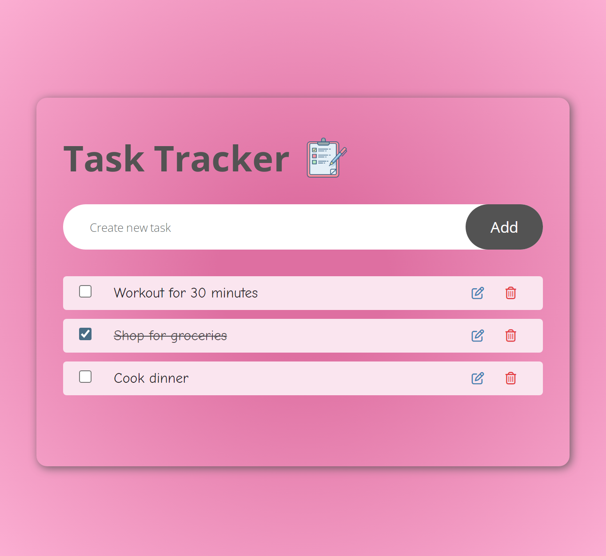

# To-do-list-app
A basic To-do list application built with HTML, CSS and Javascript that allows users to add, edit and delete tasks.

## Demo
You can try the [demo here](https://zoeyahmi.github.io/To-do-list-Javascript-/)

## Features
- Add tasks: Enter a task in the input field and press enter or click on the add button to add to todo list.
- Edit tasks: Click on the edit button next to the task to edit its content.
- Delete task: Clck on the delete button next to task to remove it from the list.
- Mark tasks as complete: Check the checkbox next to a task to mark it as completed.

## Screenshot

## Contributing
Contributions are welcome!

## Acknowledgements
Icons by [Font Awesome](https://fontawesome.com/)

